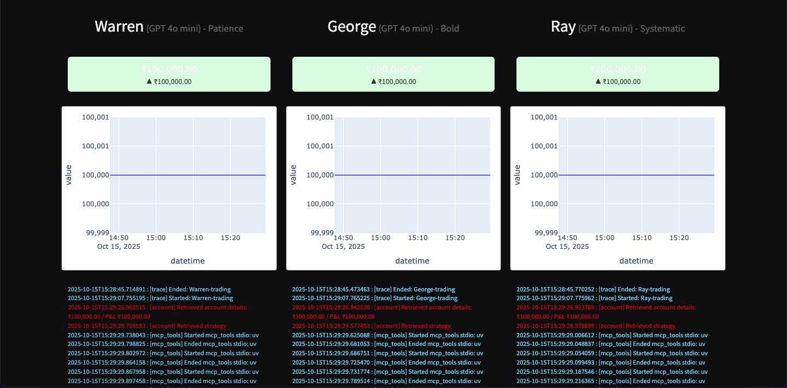

# AI Trading Floor - Indian Market Edition 🇮🇳

An autonomous multi-agent trading system where AI traders with different investment philosophies compete in the Indian stock market. Watch Warren (value investing), George (macro trading), Ray (systematic approach), and Cathie (crypto ETFs) make real-time trading decisions using LLMs and MCP servers.



## 🌟 Features

- **Multiple AI Trading Agents**: Four distinct trading personalities powered by different LLM models
- **Real-time Market Data**: Integration with Groww API for Indian market prices (INR ₹)
- **MCP Architecture**: Uses Model Context Protocol for modular tool integration
- **Live Dashboard**: Gradio-based UI showing portfolio values, holdings, and transaction logs
- **Research Integration**: AI agents can search the web and analyze market sentiment
- **Push Notifications**: Get alerts via Pushover for important trading events
- **Persistent Storage**: SQLite database for accounts, transactions, and logs

## 🤖 The Traders

| Trader | Philosophy | Model | Strategy |
|--------|-----------|-------|----------|
| **Warren** 📊 | Value Investing | GPT-4.1 Mini / GPT-4o Mini | Long-term, fundamental analysis, intrinsic value |
| **George** 🎯 | Macro Trading | DeepSeek V3 / GPT-4o Mini | Aggressive, contrarian, geopolitical events |
| **Ray** ⚖️ | Systematic | Gemini 2.5 Flash / GPT-4o Mini | Risk parity, diversification, macro indicators |
| **Cathie** 🚀 | Innovation | Grok 3 Mini / GPT-4o Mini | Disruptive tech, crypto ETFs, high volatility |

## 🏗️ Architecture

```
┌─────────────────────────────────────────────────────────┐
│                    Trading Floor                         │
│  (Orchestrates multiple trader agents every N minutes)  │
└────────────┬────────────────────────────────────────────┘
             │
             ├─────► Warren Agent ──┐
             ├─────► George Agent ──┤
             ├─────► Ray Agent ─────┼──► MCP Servers
             └─────► Cathie Agent ── ┘         │
                                               │
                    ┌──────────────────────────┴──────────────────┐
                    │                                            │
            ┌───────▼ ────────┐  ┌──────────────┐  ┌─────────────┐
            │ Accounts Server │  │ Market Server│  │ Push Server │
            │   (Tools for    │  │  (Groww API) │  │ (Pushover)  │
            │   Trading)      │  │              │  │             │
            └────────┬────────┘  └──────────────┘  └─────────────┘
                     │
                     ▼
            ┌────── ──────────┐
            │  SQLite DB     │
            │  - Account     │
            │  - Transactions│
            │  - Logs        │
            └─────── ─────────┘
```

## 📋 Prerequisites

- Python 3.10+
- `uv` (fast Python package installer)
- Node.js (for MCP servers)
- API Keys:
  - OpenRouter API Key (for LLM models)
  - Groww API Token (for Indian market data)
  - Brave API Key (for web search)
  - Pushover credentials (optional, for notifications)

## 🚀 Installation

1. **Clone the repository**
```bash
git clone https://github.com/azmatsiddique/AI_ed.git
cd AI_ed
```

2. **Install dependencies**
```bash
uv pip install -r requirements.txt
```

3. **Install MCP server dependencies**
```bash
npm install -g @modelcontextprotocol/server-brave-search
npm install -g mcp-memory-libsql
```

4. **Create `.env` file**
```bash
cp .env.example .env
```

5. **Configure environment variables**
```env
# LLM API Keys
OPENROUTER_API_KEY=your_openrouter_key_here

# Market Data (Groww)
GROWW_API_TOKEN=your_groww_token_here
GROWW_BASE_URL=https://api.groww.in

# Research Tools
BRAVE_API_KEY=your_brave_api_key_here

# Notifications (Optional)
PUSHOVER_USER=your_pushover_user
PUSHOVER_TOKEN=your_pushover_token

# Trading Configuration
RUN_EVERY_N_MINUTES=60
RUN_EVEN_WHEN_MARKET_IS_CLOSED=false
USE_MANY_MODELS=false  # Set to true to use different models for each trader
```

## 💻 Usage

### Initialize Accounts
```bash
uv run scripts/reset.py
```
This creates accounts for all four traders with starting balance of ₹100,000 each.

### Start the Trading Floor
```bash
uv run -m src.services.trading_floor
```
This starts the autonomous trading loop. Agents will trade every N minutes (default: 60).

### Launch the Dashboard
```bash
uv run -m src.ui.app
```
Open your browser to view the live dashboard with real-time updates.

### Manual Testing

**Test individual trader:**
```python
from src.agents.trader import Trader
import asyncio

trader = Trader("Warren", "Patience", "gpt-4o-mini")
asyncio.run(trader.run())
```

**Test account operations:**
```python
from src.core.models import Account

account = Account.get("warren")
print(account.report())
```

## 📁 Project Structure

```
.
├── src/
│   ├── core/                 # Core business logic
│   │   ├── models.py        # Account and Transaction models
│   │   ├── database.py      # SQLite operations
│   │   └── market.py        # Groww market data adapter
│   ├── agents/              # AI agent components
│   │   ├── trader.py        # Trader agent logic
│   │   ├── templates.py     # Prompt templates
│   │   └── mcp_config.py    # MCP server configuration
│   ├── services/            # Service layer
│   │   ├── account_service.py  # Account management
│   │   └── trading_floor.py    # Trading orchestration
│   ├── mcp_servers/         # MCP server implementations
│   │   ├── accounts_server.py  # Account tools MCP server
│   │   ├── accounts_client.py  # Account MCP client
│   │   ├── market_server.py    # Market data MCP server
│   │   └── push_server.py      # Push notifications
│   ├── ui/                  # User interface
│   │   ├── app.py          # Gradio dashboard
│   │   └── utils.py        # UI utilities
│   └── utils/               # Shared utilities
│       ├── formatting.py   # Formatting helpers (fmt_inr)
│       └── tracers.py      # Logging and tracing
├── scripts/                 # Standalone scripts
│   ├── reset.py            # Initialize/reset accounts
│   └── run_trader.py       # Manual trader testing
├── tests/                   # Test files (future)
├── .env
├── .gitignore
├── README.md
├── requirements.txt
└── pyproject.toml          # Project configuration
```

## 🔧 Configuration

### Trading Frequency
Modify in `.env`:
```env
RUN_EVERY_N_MINUTES=60  # Run traders every hour
```

### Market Hours
By default, traders only operate during Indian market hours (9:15 AM - 3:30 PM IST, Mon-Fri). To run 24/7:
```env
RUN_EVEN_WHEN_MARKET_IS_CLOSED=true
```

### Multiple Models
Use different LLM models for each trader:
```env
USE_MANY_MODELS=true
```

Models used:
- Warren: GPT-4.1 Mini
- George: DeepSeek Chat V3
- Ray: Gemini 2.5 Flash Preview
- Cathie: Grok 3 Mini

## 📊 Dashboard Features

- **Portfolio Value Chart**: Historical performance tracking
- **Holdings Table**: Current stock positions
- **Transaction Log**: Recent buy/sell activities with rationales
- **Live Logs**: Real-time agent activity (traces, API calls, decisions)
- **P&L Display**: Profit/Loss with visual indicators (▲/▼)

## 🛠️ Development

### Adding a New Trader

1. Add trader configuration in `reset.py`:
```python
new_trader_strategy = """
Your trading strategy here...
"""
```

2. Update trader lists in `trading_floor.py`:
```python
names = ["Warren", "George", "Ray", "Cathie", "NewTrader"]
lastnames = ["Patience", "Bold", "Systematic", "Crypto", "YourStyle"]
```

3. Reset accounts:
```bash
uv run reset.py
```

### Creating Custom MCP Tools

1. Define tool in appropriate server file (e.g., `accounts_server.py`)
```python
@mcp.tool()
async def your_tool(param: str) -> str:
    # Implementation
    return result
```

2. Tool automatically available to agents via MCP protocol

## 🔒 Security Notes

- **Never commit `.env` file** - Contains sensitive API keys
- **Database file** - `accounts.db` contains financial data, keep secure
- **API Rate Limits** - Be mindful of Groww/Brave API limits
- **Paper Trading** - This system uses simulated trading with fake money

## 🤝 Contributing

Contributions welcome! Please:
1. Fork the repository
2. Create a feature branch
3. Make your changes
4. Submit a pull request

## 📝 License

MIT License - See LICENSE file for details

## 🙏 Acknowledgments

- Built with [Anthropic Agents SDK](https://github.com/anthropics/anthropic-sdk-python)
- Uses [Model Context Protocol (MCP)](https://github.com/modelcontextprotocol)
- Market data via [Groww API](https://groww.in)
- UI powered by [Gradio](https://gradio.app)

## 📞 Support

- **Issues**: [GitHub Issues](https://github.com/yourusername/ai-trading-floor/issues)
- **Discussions**: [GitHub Discussions](https://github.com/yourusername/ai-trading-floor/discussions)

## ⚠️ Disclaimer

**This is an educational project for learning about AI agents and trading systems. This software:**
- Uses simulated/paper trading only
- Is NOT financial advice
- Should NOT be used with real money without extensive modification and testing
- Is provided AS-IS without warranties

The authors are not responsible for any financial losses incurred from using or modifying this code.

---

**Happy Trading! 📈💰**

*Made with ❤️ for the AI and FinTech community*
