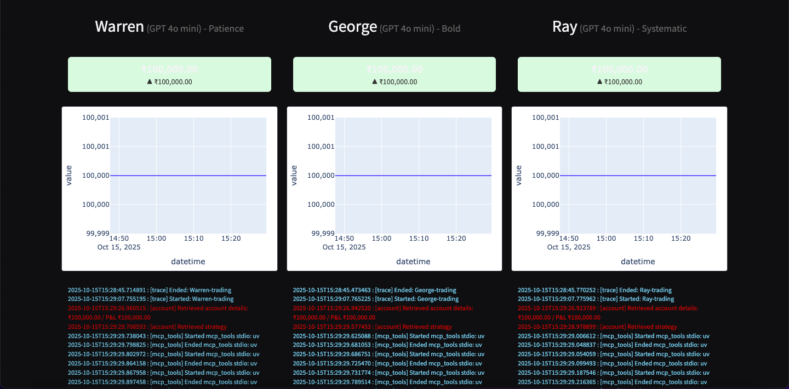

# AI Trading Floor - Indian Market Edition 🇮🇳

An autonomous multi-agent trading system where AI traders with different investment philosophies compete in the Indian stock market. Watch Warren (value investing), George (macro trading), Ray (systematic approach), and Cathie (crypto ETFs) make real-time trading decisions using LLMs, PinchTab browser automation, INDmoney chart/wallet integration, and MCP servers.



## 🌟 Features

- **Multiple AI Trading Agents**: Four distinct trading personalities powered by different LLM models
- **Real-time Market Data**: Integration with Groww API for Indian market prices (INR ₹)
- **PinchTab Web Automation**: Token-efficient browser daemon for live financial research across Moneycontrol, Economic Times, Livemint, and public web sources
- **INDmoney Integration**: Stock chart data retrieval, technical price action, and wallet balance tracking via official INDmoney MCP server (`https://mcp.indmoney.com/mcp`) and browser fallback
- **MCP Architecture**: Uses Model Context Protocol for modular tool integration
- **Live Dashboard**: Gradio-based UI showing portfolio values, holdings, PinchTab status, INDmoney wallet indicators, and live transaction logs
- **Push Notifications**: Get alerts via Pushover for important trading events
- **Persistent Storage**: SQLite database for accounts, transactions, and logs

## 🤖 The Traders

| Trader | Philosophy | Model | Strategy |
|--------|-----------|-------|----------|
| **Warren** 📊 | Value Investing | GPT-4.1 Mini / GPT-4o Mini | Long-term, fundamental analysis, intrinsic value |
| **George** 🎯 | Macro Trading | DeepSeek V3 / GPT-4o Mini | Aggressive, contrarian, geopolitical events |
| **Ray** ⚖️ | Systematic | Gemini 2.5 Flash / GPT-4o Mini | Risk parity, diversification, macro indicators |
| **Cathie** 🚀 | Innovation | Grok 3 Mini / GPT-4o Mini | Disruptive tech, crypto ETFs, high volatility |

## 🏗️ Architecture

```
┌─────────────────────────────────────────────────────────┐
│                    Trading Floor                        │
│  (Orchestrates multiple trader agents every N minutes)  │
└────────────┬────────────────────────────────────────────┘
             │
             ├─────► Warren Agent ──┐
             ├─────► George Agent ──┤
             ├─────► Ray Agent ─────┼──► MCP Servers
             └─────► Cathie Agent ──┘         │
                                              │
        ┌─────────────────────────────────────┴─────────────────────────────────────┐
        │                                                                           │
┌───────▼ ────────┐  ┌──────────────┐  ┌─────────────┐  ┌──────────────┐  ┌─────────▼──────┐
│ Accounts Server │  │ Market Server│  │ Push Server │  │ PinchTab MCP │  │ INDmoney MCP  │
│   (Trading)     │  │  (Groww API) │  │ (Pushover)  │  │ (Web Browser)│  │(Charts/Wallet)│
└────────┬────────┘  └──────────────┘  └─────────────┘  └──────────────┘  └───────────────┘
         │
         ▼
┌─────────────────┐
│   SQLite DB     │
│  - Account      │
│  - Transactions │
│  - Logs         │
└─────────────────┘
```

## 📋 Prerequisites

- Python 3.10+
- `uv` (fast Python package installer)
- Node.js 18+ (for MCP servers and PinchTab)
- API Keys & Tokens:
  - OpenRouter API Key (for LLM models)
  - Groww API Token (for Indian market data)
  - INDmoney MCP Token (optional, for `https://mcp.indmoney.com/mcp`)
  - Brave API Key (optional, for web search)
  - Pushover credentials (optional, for notifications)

## 🚀 Quick Start & Installation

1. **Clone the repository**
```bash
git clone https://github.com/azmatsiddique/AI_ed.git
cd AI_ed
```

2. **Install dependencies**
```bash
uv pip install -r requirements.txt
npm install
```

3. **Install & Verify PinchTab Browser Daemon**
```bash
npm install pinchtab
./node_modules/.bin/pinchtab server status
```

4. **Create `.env` file**
```bash
cp .env.example .env
```

5. **Configure environment variables in `.env`**
```env
# LLM API Keys
OPENROUTER_API_KEY=your_openrouter_key_here

# Market Data (Groww)
GROWW_API_TOKEN=your_groww_token_here
GROWW_BASE_URL=https://api.groww.in

# INDmoney / INDstocks Integration
INDMONEY_MCP_URL=https://mcp.indmoney.com/mcp
INDMONEY_MCP_TOKEN=your_indmoney_mcp_token_here

# Trading Configuration
RUN_EVERY_N_MINUTES=60
RUN_EVEN_WHEN_MARKET_IS_CLOSED=false
USE_MANY_MODELS=false
```

---

## 💻 Usage & Running the System

### 1. Initialize Accounts
```bash
uv run scripts/reset.py
```
This creates accounts for all four traders with a starting balance of ₹100,000 each.

### 2. Launch the Live Trading Desk Dashboard
```bash
uv run -m src.ui.app
```
Open your browser to `http://127.0.0.1:7860` to view real-time portfolio charts, trader terminals, PinchTab status, and INDmoney wallet indicators.

### 3. Start the Autonomous Trading Loop
```bash
uv run -m src.services.trading_floor
```
This starts the autonomous multi-agent trading engine. Traders will analyze markets, inspect INDmoney chart data, conduct PinchTab web research, and execute trades every N minutes.

### 4. Manual Trader Testing
```bash
uv run scripts/run_trader.py --trader Warren
```

---

## 🧪 Integration Tests

Run the automated integration test suites:

- **Test PinchTab Browser Agent**:
```bash
uv run python tests/test_pinchtab_integration.py
```

- **Test INDmoney Wallet & Chart Data**:
```bash
uv run python tests/test_indmoney_integration.py
```

---

## 📁 Project Structure

```
.
├── src/
│   ├── core/                  # Core business logic (models, database, Groww market)
│   ├── trading_agents/        # Trader agent logic, prompts, and MCP config
│   │   ├── trader.py          # Trader execution loop
│   │   ├── templates.py       # Trader prompt templates
│   │   └── mcp_config.py      # MCP server registrations
│   ├── services/              # Service layer (trading floor orchestrator)
│   ├── mcp_servers/           # Model Context Protocol servers
│   │   ├── accounts_server.py # Account management MCP server
│   │   ├── market_server.py   # Groww market data MCP server
│   │   ├── pinchtab_server.py # PinchTab browser automation MCP server
│   │   ├── indmoney_server.py # INDmoney chart data & wallet MCP server
│   │   └── push_server.py     # Pushover notifications MCP server
│   ├── ui/                    # User interface (Gradio dashboard)
│   │   ├── app.py            # Live desk dashboard app
│   │   └── utils.py          # UI styling & color palettes
│   └── utils/                 # Utility clients
│       ├── pinchtab_client.py # PinchTab HTTP API client
│       ├── indmoney_client.py # INDmoney API/MCP client
│       └── tracers.py        # Logging and tracing
├── scripts/                   # Management scripts
│   ├── reset.py              # Reset trader balances
│   └── run_trader.py         # Test individual trader
├── tests/                     # Integration tests
│   ├── test_pinchtab_integration.py
│   └── test_indmoney_integration.py
├── .env
├── .gitignore
├── README.md
└── pyproject.toml
```

---

## 📝 License

MIT License - See LICENSE file for details.

---

**Happy Autonomous Trading! 📈💰**
